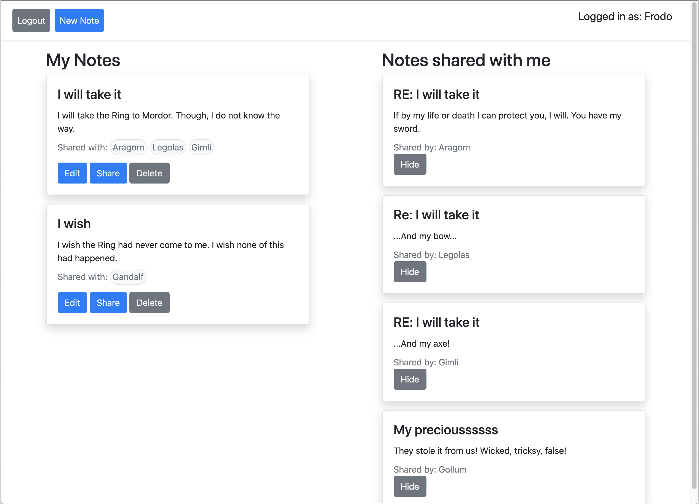
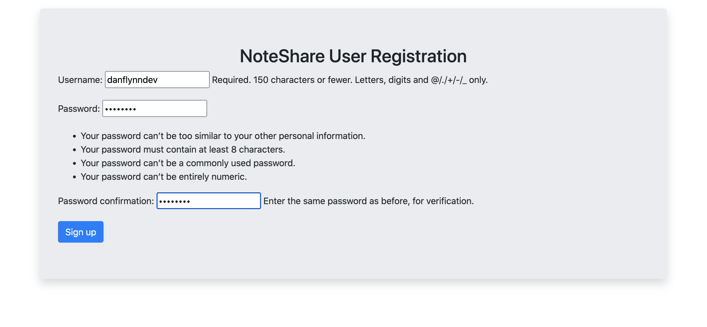
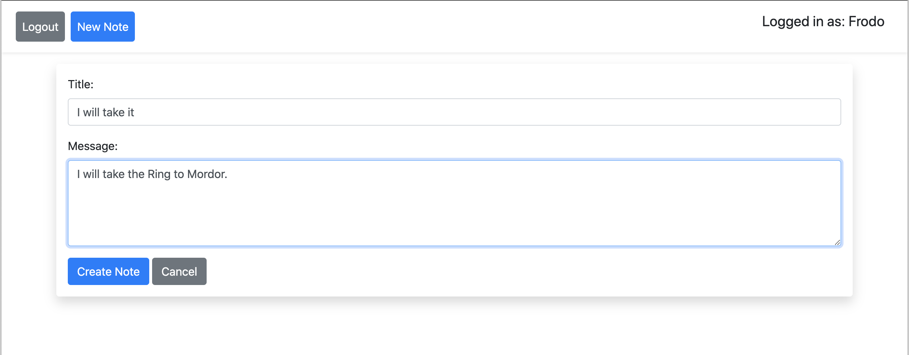
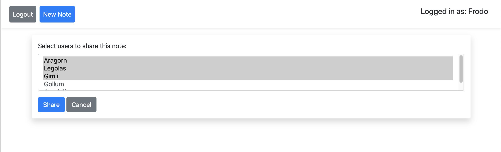
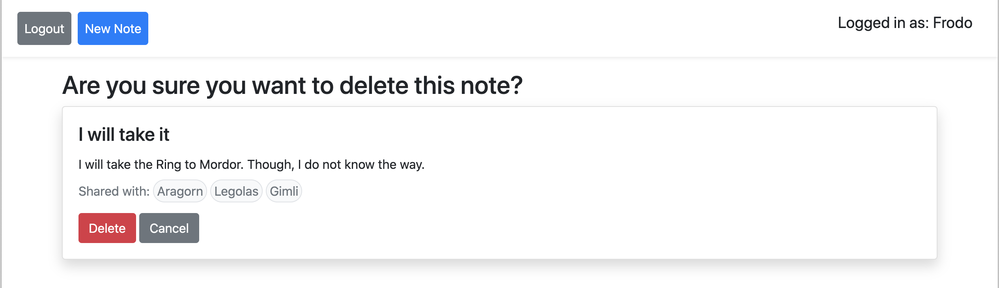

# NoteShare App
## CSC225 Adv. Python Programming Capstone Project

Completed during Fall 2021 semester at BHCC

---

### Project Requirements

- Built with Django framework
- Requires users to sign up and login. Redirects to login page if not logged in.
- Users can create notes and share with other users
- Displays all notes as well as notes shared with user

**Extra Credit for:**

- Users can edit and delete notes after creation
- Users can share notes with multiple other users

### Implementation Notes

- app uses the `@login_required` decorator from Django
- I used a very simple implementation of Bootstrap in conjuntion with HTML templates for the site design.
- This code allows for the selection of multiple users at once in the Share view:
```
window.onload = function(){
        const options = document.querySelectorAll('option');
        options.forEach(opt => {
            opt.addEventListener('mousedown', e => {
                e.preventDefault();
                if (opt.selected == true) {
                    return opt.selected = false;
                } else if (opt.selected == false) {
                    return opt.selected = true;
                }
            })
        })
    }
```

### Images




